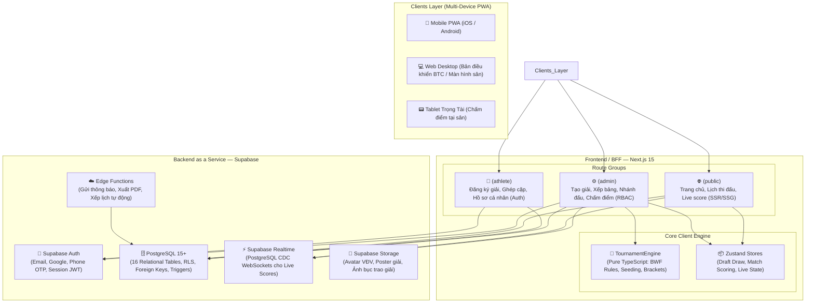
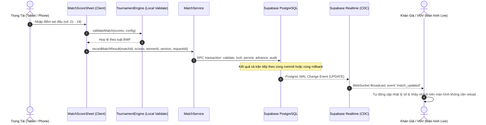
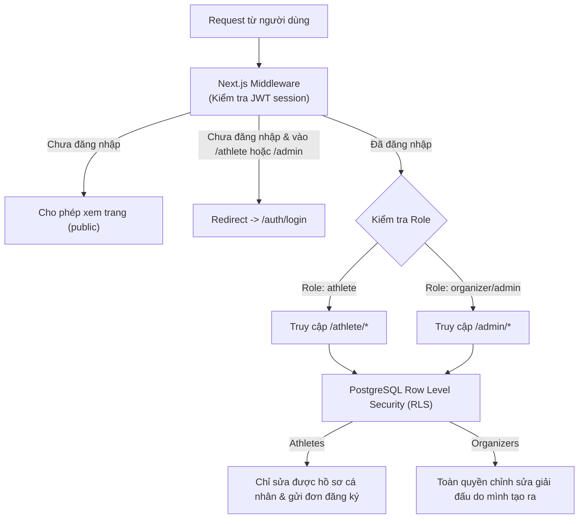

# Kiến Trúc Hệ Thống — Badminton Tournament Platform

Tài liệu này đặc tả toàn bộ kiến trúc phần mềm, luồng dữ liệu, phân tầng ứng dụng và các chiến lược kỹ thuật cho hệ thống Web/PWA Tổ chức Giải đấu Cầu lông.

---

## 1. Tổng Quan Kiến Trúc (High-Level Architecture)

Hệ thống được thiết kế theo kiến trúc phân tán hiện đại, tận dụng sức mạnh của **Next.js 15** ở tầng Frontend/BFF và **Supabase (PostgreSQL 15+)** ở tầng Backend dữ liệu & Realtime.

---

## 2. Phân Tầng Tuyến Đường (Route Groups Structure)

Để đảm bảo hiệu năng cao nhất, phân quyền chuẩn mực và tối ưu hóa trải nghiệm người dùng, ứng dụng Next.js 15 được chia thành 3 Route Group riêng biệt:

### 2.1. Cổng Công Khai — `(public)`
- **Mục tiêu**: Tốc độ tải trang cực nhanh (<1s), thân thiện SEO, chia sẻ liên kết mạng xã hội (Facebook, Zalo) có OpenGraph Card đầy đủ.
- **Kỹ thuật render**:
  - Trang danh sách giải: **Server Components** kết hợp Dynamic Rendering với cache tagging (`revalidateTag`).
  - Trang chi tiết giải / Lịch thi đấu: **Server Components** sinh khung HTML ban đầu + **Client Components** lắng nghe Supabase Realtime để cập nhật tỷ số trận đấu ngay lập tức.
- **Tuyến đường**:
  - `/`: Trang chủ quảng bá các giải đấu đang diễn ra và sắp khởi tranh.
  - `/tournaments`: Danh mục tra cứu toàn bộ giải đấu (lọc theo ngày, khu vực, thể thức).
  - `/tournaments/[slug]`: Chi tiết giải công khai (Điều lệ giải, Danh sách VĐV, Sơ đồ thi đấu, Bảng xếp hạng).
  - `/tournaments/[slug]/live`: Màn hình bảng điểm điện tử trực tiếp dành cho khán giả tại sân hoặc theo dõi từ xa.

### 2.2. Cổng Vận Động Viên — `(athlete)`
- **Mục tiêu**: Trải nghiệm mượt mà như Native App trên điện thoại thông qua PWA, đơn giản hóa tối đa quy trình đăng ký giải đấu.
- **Kỹ thuật**: Client-side rendering với xác thực tài khoản thông qua Supabase Auth Session. Tự động chuyển hướng nếu người dùng chưa đăng nhập.
- **Tuyến đường**:
  - `/athlete/dashboard`: Bảng điều khiển cá nhân (Các giải sắp đấu, tình trạng duyệt đơn, lịch thi đấu sắp tới của bản thân).
  - `/athlete/register/[tournamentId]`: Wizard đăng ký tham gia giải đấu (chọn nội dung thi đấu, nhập thông tin cá nhân, chọn/mời đồng đội đánh đôi).
  - `/athlete/profile`: Quản lý hồ sơ vận động viên (tên hiển thị, ngày sinh, số điện thoại, CLB trực thuộc, hình đại diện, cấp độ kỹ năng).
  - `/athlete/history`: Thống kê thành tích và lịch sử đối đầu của VĐV qua các mùa giải.

### 2.3. Cổng Ban Tổ Chức & Trọng Tài — `(admin)`
- **Mục tiêu**: Công cụ điều hành giải đấu chuyên nghiệp, thao tác bốc thăm, điều phối lịch thi đấu và chấm điểm chính xác theo luật BWF.
- **Kỹ thuật**: Bảo vệ bằng Middleware kiểm tra quyền (`organizer` hoặc `admin`). Áp dụng thư viện kéo thả `@dnd-kit` và hiển thị đồ họa nhánh đấu.
- **Tuyến đường**:
  - `/admin/dashboard`: Báo cáo số lượng giải đấu, số VĐV, doanh thu lệ phí (nếu có).
  - `/admin/tournaments/create`: Trình khởi tạo giải đấu V2 hỗ trợ đa nội dung (Đơn Nam, Đôi Nam, Đôi Nữ, Đôi Nam Nữ) và luật linh hoạt từng vòng.
  - `/admin/tournaments/[id]`: Trạm điều phối giải đấu trung tâm gồm các tab:
    - *Đăng ký & VĐV*: Duyệt / từ chối đơn đăng ký, thêm VĐV vãng lai, gán hạt giống (Seed).
    - *Chia Bảng*: Xếp bảng tự động theo thuật toán Snake Seeding hoặc kéo thả thủ công.
    - *Nhánh Knockout*: Sinh sơ đồ nhánh đấu BWF, bảo vệ hạt giống, tách nhánh cùng CLB.
    - *Lịch Đấu & Sân*: Xếp thứ tự trận đấu theo số sân thực tế.
    - *Chấm Điểm*: Modal chấm điểm theo luật BWF, xử lý bỏ cuộc (Walkover, Retired), hủy/sửa kết quả có cascade rollback.
    - *Bế Mạc & Trao Giải*: Podium vinh quang tự động trích xuất Nhà vô địch, Á quân, Đồng hạng Ba.

### 2.4. Bản Đồ Tuyến Đường Thực Tế (Current Codebase Routes — 18 Routes)
> [!NOTE]
> Các mục 2.1–2.3 là thiết kế phân quyền đích (Target Specs). Trong codebase thực tế hiện tại, ứng dụng Next.js 15 đang tổ chức theo 18 routes phẳng như sau:
> - **Cổng Công Khai**: `/` (Trang chủ), `/tournaments/[slug]` (Chi tiết giải), `/tournaments/[slug]/register` (Đăng ký), `/scoreboard` & `/scoreboard/court/[courtNumber]` (Bảng điểm sân), `/rankings` (Bảng xếp hạng).
> - **Cổng Đăng Ký & Tài Khoản**: `/login`, `/register`, `/register/organizer`, `/register/partner-accept`.
> - **Cổng Quản Trị BTC**: `/admin/tournaments` (Danh sách giải), `/admin/tournaments/create` (Wizard tạo giải 4 bước).
> - **Giao Diện Điều Hành & Prototype Chuyên Sâu**:
>   - `/prototypes/organizer-draw`: Bốc thăm, xếp bảng Berger, sinh nhánh Knockout, nhập tỷ số.
>   - `/prototypes/court-dispatcher`: Trạm điều phối sân đấu FSM, hàng chờ trận, live clock.
>   - `/prototypes/umpire-scoring`: Tablet chấm điểm trọng tài tại sân.
>   - `/prototypes/match-scoresheet`: Biên bản điện tử chi tiết trận đấu.
>   - `/prototypes/athlete-registration`: Giao diện thử nghiệm luồng VĐV đăng ký.

---

## 3. Kiến Trúc Dữ Liệu Thời Gian Thực (Realtime Architecture)

Hệ thống cung cấp trải nghiệm cập nhật tỷ số "Live Score" không độ trễ giữa Trọng tài tại sân và Khán giả/VĐV:

### Thiết kế Kênh Realtime (Channels)
1. **Channel `tournament-live:${tournamentId}`**:
   - Nguồn sự thật: Postgres Changes của `tournament_matches`; mỗi bản ghi có `version` để client phát hiện thứ tự sai hoặc reconnect và refetch.
   - Broadcast chỉ cho tín hiệu tức thời không lưu bền (ví dụ `CALL_TO_COURT`), không dùng để đồng bộ kết quả.
2. **Channel `athlete:${athleteId}`**:
   - Gửi thông báo cá nhân cho VĐV: "Bạn có trận đấu tại Sân số 2 trong 10 phút nữa!".

---

## 4. Chiến Lược Ứng Dụng Web Lũy Tiến (PWA Strategy)

Hệ thống được thiết kế theo tiêu chuẩn PWA hạng nhất (First-Class PWA) để người dùng cài đặt như ứng dụng native:

### 4.1. Web App Manifest (`manifest.json`)
- Hỗ trợ cài đặt trên Android, iOS và Desktop với biểu tượng thương hiệu chuẩn sắc nét.
- `display: standalone`: Ẩn thanh địa chỉ trình duyệt, mở toàn màn hình.
- Theme Color thể thao chuyên nghiệp (#0f172a slate-900 / #06b6d4 cyan-500).

### 4.2. Service Worker & Chiến Lược Caching
Ứng dụng sử dụng **Serwist** (hoặc `next-pwa`) để quản lý Service Worker với 3 tầng cache:
- **Network-First (Ưu tiên mạng)**: Dành cho API dữ liệu động (`/api/matches`, Supabase calls). Nếu mất kết nối mạng, trả về dữ liệu cache gần nhất trong IndexedDB.
- **Stale-While-Revalidate**: Dành cho giao diện tĩnh, font chữ Google Fonts, CSS và JS bundles.
- **Cache-First (Ưu tiên bộ nhớ đệm)**: Dành cho hình ảnh huy chương, bục trao giải, logo câu lạc bộ.

### 4.3. Web Push Notifications
- Tích hợp Web Push API cho phép gửi thông báo gọi tên vận động viên vào sân thi đấu ngay cả khi trình duyệt đang tắt hoặc điện thoại đang khóa màn hình.

---

## 5. Mô Hình Bảo Mật & Phân Quyền (RBAC & RLS)

Toàn bộ hệ thống kiểm soát quyền hạn chặt chẽ ở 2 tầng: **Next.js Middleware** và **PostgreSQL Row Level Security (RLS)**.

### Các vai trò người dùng (Roles)
1. **Khách (Anonymous)**: Chỉ được quyền `SELECT` dữ liệu của giải vừa `is_public` vừa ở trạng thái đã phát hành; không đọc trực tiếp hồ sơ VĐV có PII (email, SĐT, ngày sinh).
2. **Vận Động Viên (Athlete)**:
   - Được quyền cập nhật thông tin cá nhân của mình trong bảng `athletes`.
   - Được quyền tạo và hủy đơn đăng ký của bản thân trong `tournament_registrations`.
   - Xem các trận đấu và thông báo riêng của mình.
3. **Ban Tổ Chức (Organizer)**:
   - Quản lý các giải đấu, nội dung thi đấu, bảng đấu và danh sách VĐV thuộc quyền sở hữu của mình (`tournaments`, `tournament_events`, `tournament_groups`, `tournament_registrations`, `tournament_entries`).
   - **Đối với bảng `tournament_matches`**: Chỉ có quyền `SELECT` trực tiếp thông qua RLS. Mọi thao tác ghi điểm (`record_score_snapshot`), chốt kết quả (`finalize_match_result`), hủy kết quả (`cancel_match_result`) hay điều phối lịch/sân **bắt buộc** phải thực thi thông qua các hàm `SECURITY DEFINER` RPC hoặc Server Actions được ủy quyền. Tuyệt đối không mở chính sách `UPDATE`/`DELETE` trực tiếp trên bảng này để bảo toàn tính toàn vẹn nhánh đấu, audit log và kiểm soát phiên bản `version`.
   - Duyệt hoặc từ chối các đơn đăng ký thi đấu.
4. **Quản Trị Viên Hệ Thống (Super Admin)**:
   - Quản lý tất cả giải đấu, xác minh tài khoản ban tổ chức, cấu hình hệ thống toàn cục.
   - Quyền này chỉ được cấp qua backend/provisioning đáng tin cậy, không suy ra từ dữ liệu do client tự tạo.
