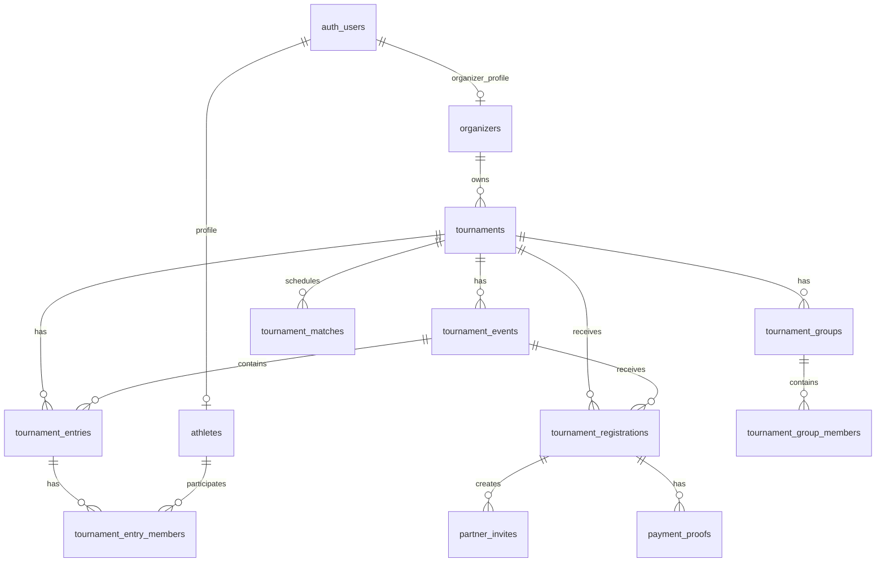

# Cơ Sở Dữ Liệu — Badminton Tournament Platform

`sql/schema.sql` là nguồn DDL chuẩn để bootstrap môi trường mới. Lược đồ có 16 bảng nghiệp vụ, chạy trên Supabase PostgreSQL 15+ và ưu tiên tính toàn vẹn của kết quả giải hơn là tối ưu tiện tay cho UI.

---

## 1. Nguyên tắc dữ liệu

- **Nội dung thi đấu là quan hệ, không là JSONB**: `tournament_events` giữ quota, lệ phí và cấu hình từng nội dung. `rules_config`/`stage_configs` chỉ dùng cho cấu hình linh hoạt đã được validate.
- **Thành viên đội là quan hệ, không là mảng UUID**: `tournament_entry_members` cho phép unique constraint, truy vấn lịch VĐV và thống kê đúng.
- **Kết quả là server-authoritative**: browser không tự update winner/nhánh. RPC thực hiện lock, validate, advance/rollback, audit và tăng `tournament_matches.version` trong cùng transaction.
- **Không lộ PII**: email, SĐT, ngày sinh nằm ở `athletes`; API công khai chỉ trả tên đội/tên hiển thị được phép, không cấp `SELECT` công khai trên hồ sơ này.
- **Mọi giờ đều timezone-aware**: `tournaments.timezone` mặc định `Asia/Ho_Chi_Minh`; các thời điểm lưu `TIMESTAMPTZ`.

## 2. ERD lõi

## 3. Bảng và trách nhiệm

| Nhóm | Bảng | Trách nhiệm |
|---|---|---|
| Danh tính | `athletes`, `organizers` | Hồ sơ VĐV/BTC liên kết `auth.users`. Tạo organizer là luồng provisioning đáng tin cậy, không phải client tự nâng quyền. |
| Giải đấu | `tournaments`, `tournament_events` | Giải, timezone, trạng thái công bố và các nội dung/format/quota riêng. |
| Đăng ký | `tournament_registrations`, `partner_invites`, `payment_proofs` | Đơn, xác nhận đánh đôi, invite token dạng hash, chứng từ thanh toán và hạn waitlist. |
| Danh sách chính thức | `tournament_entries`, `tournament_entry_members` | Team/entry đã chốt và thành viên theo thứ tự 1–2. |
| Vận hành | `tournament_groups`, `tournament_group_members`, `tournament_matches` | Chia bảng, lịch/trận và snapshot tỷ số. `version` chống ghi đè kết quả cũ. |
| Hỗ trợ | `notifications`, `athlete_stats`, `activity_logs`, `system_settings` | Thông báo, thống kê, audit và cấu hình toàn cục. |

## 4. Ràng buộc bắt buộc ở tầng DB/RPC

1. Mỗi registration phải tham chiếu event cùng tournament; RPC kiểm tra điều này trước khi tạo/chốt dữ liệu.
2. Event đánh đơn có đúng một member; đánh đôi có đúng hai member. `finalize_entries` từ chối partner chưa xác nhận hoặc VĐV đã có entry của cùng event.
3. Waitlist dùng `registered_at` để xếp hàng và `waitlist_expires_at` để server job quyết định đôn/hết hạn.
4. `payment_status` và `status` là hai trục riêng. “Confirmed” chỉ là trạng thái hiển thị dẫn xuất từ `approved` + `paid/waived`.
5. `result_request_id` là idempotency key; client retry phải gửi lại cùng ID. `expectedVersion` sai trả về conflict thay vì ghi đè.
6. Chỉ RPC `record_score_snapshot` được cập nhật tỷ số trực tiếp khi trận đang đấu (`in_progress`); chỉ RPC `finalize_match_result` được chốt tỷ số chung cuộc, gán `winner_id` và thăng nhánh; chỉ RPC `cancel_match_result` được rollback kết quả; chỉ RPC `correct_match_score` (dành cho BTC) được can thiệp điều chỉnh có audit log. Client không có quyền `UPDATE`/`DELETE` trực tiếp trên `tournament_matches`.

## 5. RLS và dữ liệu công khai

- Anonymous chỉ thấy giải `is_public = true` đã mở/đang diễn ra/hoàn thành. Nhánh, bảng và trận chỉ hiện khi giải phù hợp để công bố (từ lúc đã chốt danh sách & bốc thăm xong: `registration_closed`, `in_progress`, `completed`).
- Athlete tạo/đọc/sửa hồ sơ của chính họ, nộp và xem đơn của chính họ.
- Organizer chỉ quản lý tournament, event, registration, entry và group thuộc organizer của mình; với match họ chỉ đọc trực tiếp và gọi RPC được ủy quyền để sửa lịch/trạng thái/kết quả.
- `partner_invites`, `payment_proofs`, activity log và tác vụ đối soát đi qua Server Action/RPC/Edge Function có xác thực; raw token không lưu DB.
- Trước khi production, kiểm thử RLS bằng ba JWT độc lập: anonymous, athlete A, organizer A; đặc biệt thử truy cập chéo athlete B và organizer B.

## 6. Chỉ mục tối thiểu

Schema đã tạo index cho slug/trạng thái giải, match theo giải/stage/status, registration theo giải/VĐV, entries/events, entry member và invite. Khi đã có tải thật, dùng `EXPLAIN (ANALYZE, BUFFERS)` trên các truy vấn public/live thay vì thêm index theo cảm tính.

## 7. Dữ liệu lịch sử và migration

`schema.sql` là bootstrap schema, không phải migration có thể chạy an toàn trên database đã tồn tại. Khi đã triển khai môi trường dùng chung, mọi thay đổi phải là migration có version, up/down hoặc kế hoạch backfill, và được chạy trước khi code dùng cột/bảng mới.
