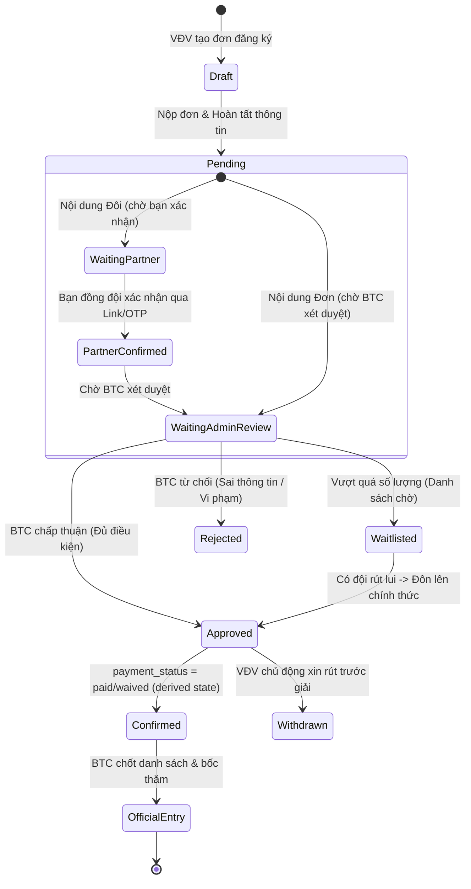
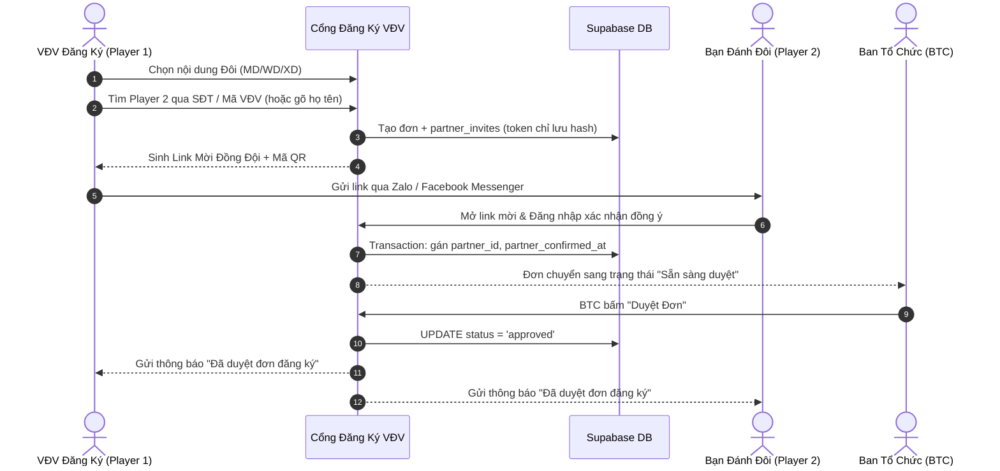
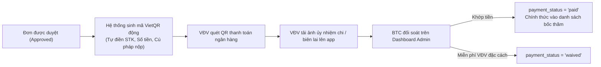

# Quy Trình Đăng Ký Vận Động Viên — Registration Portal Specs

Tài liệu này đặc tả toàn bộ quy trình nghiệp vụ của **Cổng Đăng Ký Vận Động Viên (Athlete Portal)**, cơ chế ghép cặp thi đấu đôi, trạng thái phê duyệt của Ban Tổ Chức (BTC) và quy trình xác thực thanh toán lệ phí.

---

## 1. Sơ Đồ Trạng Thái Đơn Đăng Ký (State Machine)

Mỗi đơn đăng ký giải đấu trải qua một chuỗi các trạng thái được kiểm soát chặt chẽ bởi hệ thống:

---

## 2. Luồng Nghiệp Vụ Chi Tiết (Step-by-Step User Flow)

### 2.1. Đăng Ký Nội Dung Đơn (Singles: MS / WS)
1. **Bước 1 — Chọn giải đấu & nội dung**:
   - VĐV xem trang thông tin giải đấu và bấm **"ĐĂNG KÝ THAM GIA"**.
   - Chọn nội dung thi đấu: *Đơn Nam (MS)* hoặc *Đơn Nữ (WS)*.
2. **Bước 2 — Xác thực thông tin cá nhân**:
   - Nếu đã đăng nhập: Hệ thống tự động điền Họ tên, Số điện thoại, Email, CLB, Ngày sinh.
   - Nếu chưa đăng nhập: Yêu cầu đăng nhập nhanh qua Google hoặc số điện thoại (OTP).
3. **Bước 3 — Thông tin bổ sung**:
   - Khai báo câu lạc bộ đang sinh hoạt (để hệ thống kích hoạt tính năng **Club Separation** tránh gặp người cùng CLB ở vòng 1).
   - Đề xuất xin xét Hạt giống (kèm lý do hoặc thành tích các giải trước).
4. **Bước 4 — Nộp đơn**:
   - Hệ thống tạo bản ghi trong bảng `tournament_registrations` với `status = 'pending'`.
   - Gửi thông báo xác nhận đã nộp đơn thành công đến VĐV.

---

### 2.2. Đăng Ký Nội Dung Đôi (Doubles: MD / WD / XD) & Cơ Chế Mời Bạn Cùng Đấu

Nội dung đánh đôi đòi hỏi sự đồng thuận của cả 2 vận động viên để tránh việc bị đăng ký khống:

#### Phương Thức Ghép Đôi Linh Hoạt:
1. **Trường hợp Bạn cùng đấu đã có tài khoản**: Tìm kiếm bằng số điện thoại hoặc tên qua RPC bảo mật có giới hạn tần suất (`searchPartnerByPhone`, rate-limit tối đa 5 lần/phút/user). Endpoint này **chỉ trả về tên hiển thị, avatar và CLB** (giấu hoàn toàn SĐT, email và PII để tránh bị quét dò dữ liệu); hệ thống gửi thông báo In-App + Web Push để bạn vào bấm xác nhận.
2. **Trường hợp Bạn cùng đấu chưa có tài khoản**: VĐV 1 nhập họ tên và số điện thoại của bạn, hệ thống sinh ra một liên kết định danh bí mật (`/athlete/partner-invite?token=...`). VĐV 2 chỉ cần bấm vào link để đăng ký nhanh và xác nhận ghép đội.
3. **Trường hợp Đăng ký dạng "Ghép Cặp Tự Do"**: VĐV chưa có bạn đánh đôi có thể chọn cờ *"Cần tìm bạn đánh đôi"*. BTC hoặc các VĐV khác có thể ghép cặp sau.

### 2.3. Cơ Chế Minh Bạch Trạng Thái & Giảm Tải Cho Ban Tổ Chức (Self-Service Transparency)
Để triệt tiêu các câu hỏi trùng lặp gửi đến BTC, màn hình đăng ký và theo dõi đơn luôn ghim 4 thông tin:
- **Số suất còn lại (`Quota`)**: Hiển thị rõ số chỗ chính thức còn trống (ví dụ: *Còn 3/16 suất*), cảnh báo khi sắp chuyển sang chế độ Waitlist.
- **Tình trạng đồng đội (`Partner Status`)**: Minh bạch tiến độ mời (`Đang chờ bạn mở link xác nhận`, `Đồng đội đã đồng ý`).
- **Đồng hồ đếm ngược hạn chót (`Deadlines`)**: Thời gian còn lại để nộp phí hoặc giữ chỗ waitlist (tính theo giờ/phút).
- **Hộp lý do đơn chưa thể duyệt (`Actionable Blockers`)**: Liệt kê chính xác điều kiện còn thiếu để VĐV chủ động hoàn thiện (ví dụ: `[x] Thiếu ảnh chuyển khoản`, `[x] Bạn đánh đôi chưa xác nhận`).

---

## 3. Quy Trình Thanh Toán Lệ Phí Giải Đấu (Payment Flow)

Nếu giải đấu có thu lệ phí tham gia (`entry_fee > 0`):

- **Mã VietQR động**:
  - Tự động tạo mã QR chuyển khoản ngân hàng chuẩn Napas 247.
  - Nội dung chuyển khoản chuẩn hóa: `DKGIAI [MÃ_GIẢI] [SỐ_ĐIỆN_THOẠI]`.
- **Hỗ trợ miễn trừ lệ phí**: BTC có thể bấm *"Miễn lệ phí"* đối với khách mời đặc cách hoặc thành viên nòng cốt.

---

## 4. Quản Lý Danh Sách Chờ (Waitlist Pipeline)

Mỗi nội dung thi đấu có giới hạn tối đa số đội (`max_entries`, ví dụ: tối đa 16 đội hoặc 32 đội):
- Khi số lượng đơn đăng ký vượt quá giới hạn:
  - Các đơn tiếp theo tự động chuyển vào trạng thái `waitlisted` theo thứ tự thời gian nộp đơn (First Come, First Served).
- Nếu có một đội trong danh sách chính thức xin rút lui (`withdrawn` hoặc `rejected`):
  - Hệ thống tự động gửi thông báo cho đội đứng đầu danh sách chờ: *"Bạn có 12 giờ để xác nhận tham gia giải đấu!"*.
- Sau 12 giờ nếu không phản hồi, suất sẽ được chuyển tiếp cho đội kế tiếp.

`waitlist_expires_at` là dữ liệu bắt buộc; job server kiểm tra hạn, không để client tự đôn danh sách. `Confirmed` là trạng thái dẫn xuất: `status = 'approved'` và `payment_status IN ('paid', 'waived')`, không thêm vào enum để tránh hai nguồn trạng thái.

---

## 5. Chuyển Đổi Thành Bản Ghi Thi Đấu Chính Thức (`tournament_entries`)

Khi hạn đăng ký kết thúc và BTC bấm nút **"CHỐT DANH SÁCH & BỐC THĂM"**:
1. Hệ thống lọc tất cả các bản ghi `tournament_registrations` có `status = 'approved'` và `payment_status IN ('paid', 'waived')`.
2. Tự động sinh ra các bản ghi tương ứng trong bảng `tournament_entries` và `tournament_entry_members`.
3. Gán số hạt giống theo chỉ định của BTC; kiểm tra quota, partner đã xác nhận và không có VĐV trùng event.
4. Đưa toàn bộ danh sách `tournament_entries` vào **TournamentEngine** để tiến hành Snake Seeding hoặc chia nhánh Knockout BWF.
