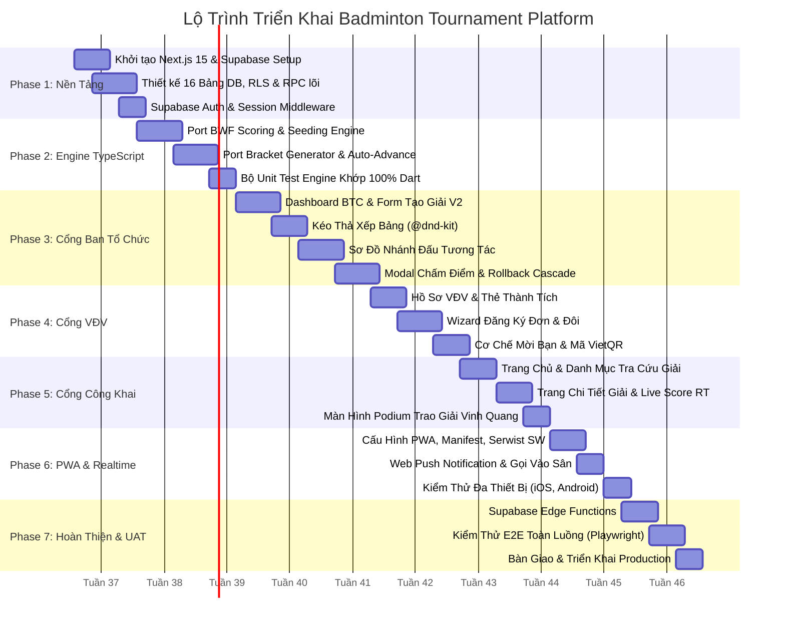

# Lộ Trình Triển Khai — Project Roadmap & Delivery Plan

Tài liệu này xác định kế hoạch thực thi chi tiết qua **7 Giai đoạn (Phases)** trong vòng **10 tuần**, kèm theo các mốc nghiệm thu (Milestones), tiêu chí chất lượng (Acceptance Criteria) và kế hoạch kiểm thử tự động.

---

## 1. Lược Đồ Tiến Độ (Gantt Chart Timeline)

---

## 2. Chi Tiết Các Giai Đoạn Triển Khai (Phases Breakdown)

> [!IMPORTANT]
> **TIẾN ĐỘ THỰC TẾ HIỆN TẠI (Tháng 9/2026):**
> Dự án đã hoàn thành Giai đoạn 1 & 2 (16 bảng DB, Engine BWF TypeScript 83 tests, 5 Interactive Prototypes).
> Để đưa sản phẩm từ bản Prototype sang bản Production hoàn chỉnh, kế hoạch đang được thực thi theo 4 Phase tại [implementation_plan.md](file:///g:/AppHavuco/tournament-web/docs/implementation_plan.md):
> - ✅ **Phase 1: Critical Fixes** (Fix 5 engine bugs, service data mapping, memo AuthContext, 83 tests pass) — **ĐÃ HOÀN THÀNH**.
> - ⏳ **Phase 2: Auth & Security** (Supabase Auth thật, Next.js Middleware, bỏ mock bypass) — **ĐANG TIẾN HÀNH**.
> - 📋 **Phase 3: Architecture Refactor** (Tách 3 god components, đưa Zustand vào quản lý state).
> - 📋 **Phase 4: Quality & i18n** (Từ điển i18n, E2E tests, CI/CD pipeline).

### 🔹 GIAI ĐOẠN 1: Hạ Tầng Kỹ Thuật & Cơ Sở Dữ Liệu (Tuần 1 – 2) — [ĐÃ XONG SCHEMA & RPCS]
- **Mục tiêu**: Thiết lập bộ khung dự án Next.js 15 App Router, TypeScript, Tailwind CSS, và triển khai 16 bảng PostgreSQL trên Supabase.
- **Nhiệm vụ cụ thể**:
  1. Khởi tạo repository, cài đặt các dependencies chuẩn mực.
  2. Chạy file script `sql/schema.sql` tạo 16 bảng cơ sở dữ liệu kèm khóa ngoại và indexes.
  3. Cấu hình và kiểm thử RLS với JWT anonymous / athlete A / organizer A; không lộ PII hay dữ liệu chéo tổ chức.
  4. Viết RPC transaction skeleton cho `record_match_result`, `cancel_match_result`, `finalize_entries` với audit, version và idempotency key.
  5. Viết các helper kết nối `@supabase/ssr` (`client.ts`, `server.ts`, `middleware.ts`).
- **Nghiệm thu**: Đăng nhập, tạo athlete profile thành công; test RLS âm pass; RPC trả conflict khi version cũ và không nhân bản khi retry cùng request ID.

---

### 🔹 GIAI ĐOẠN 2: Chuyển Đổi Tournament Engine & Interactive Prototypes (Tuần 2 – 3)
- **Mục tiêu**: Tái hiện 100% sức mạnh tính toán và thuật toán BWF sang TypeScript thuần, đồng thời xây dựng **Interactive Clickable Prototype** cho 3 luồng sống còn trước khi code đại trà.
- **Nhiệm vụ cụ thể**:
  1. Port `scoring.ts`: Validate tỷ số deuce, kịch trần 30 điểm (chấp nhận 30–28 và 30–29), Sudden Death, Best of 1/3/5.
  2. Port `seeding.ts`: BWF Seed placement và thuật toán Snake Seeding cho các bảng.
  3. Port `bracket.ts`: Tính `bracketSize`, Bye Protection, Club Separation.
  4. Port `standings.ts`: Thuật toán xếp hạng BWF (Wins $\rightarrow$ Game Diff $\rightarrow$ Point Diff $\rightarrow$ Head-to-Head).
  5. Viết golden fixtures và unit test kiểm tra các ca biên.
  6. 🎯 **Mốc Quan Trọng — Xây dựng Interactive Clickable Prototype cho 3 luồng cốt lõi**:
     - *Luồng 1 (VĐV)*: Đăng ký đôi $\rightarrow$ Mời bạn qua link/QR $\rightarrow$ Bạn mở link bấm đồng ý $\rightarrow$ Xem quota & lý do chưa chốt.
     - *Luồng 2 (BTC)*: Lọc đơn $\rightarrow$ Chốt entries $\rightarrow$ Bốc thăm bảng / nhánh Knockout $\rightarrow$ Xếp sân & giờ đấu.
     - *Luồng 3 (Trọng tài)*: Mở trận $\rightarrow$ Bấm nút +1 cực lớn $\rightarrow$ Mất mạng (offline queue) $\rightarrow$ Undo điểm nhầm $\rightarrow$ Có mạng trở lại $\rightarrow$ Modal chốt kết quả $\rightarrow$ Cập nhật tức thì lên Live Score.
- **Nghiệm thu**: Unit test engine pass 100%; prototype 3 luồng chạy mượt mà được kiểm thử và phê duyệt bởi BTC/VĐV trước khi code giao diện chi tiết.

---

### 🔹 GIAI ĐOẠN 3: Cổng Ban Tổ Chức & Trọng Tài — Màn Hình Chấm Điểm Là Trọng Tâm (Tuần 3 – 5)
- **Mục tiêu**: Hoàn thiện bộ công cụ điều hành giải đấu cho BTC và trọng tài tại sân.
- **Nhiệm vụ cụ thể**:
  1. Dashboard quản lý giải đấu và danh sách nội dung thi đấu.
  2. Form Tạo Giải Đấu V2 (đa nội dung, quota, lệ phí, cấu hình luật bảng/nhánh linh hoạt).
  3. Giao diện chia bảng kéo thả (@dnd-kit) và bốc thăm tự động (tối giản animation phức tạp để ưu tiên tốc độ).
  4. Sơ đồ nhánh đấu Knockout:
     - *Trên mobile*: Mặc định xem theo từng vòng đấu, có thanh chọn vòng nhanh và nút **"Trận của tôi"** để tìm nhanh.
     - *Trên desktop/tablet*: Full bracket tree tương tác hỗ trợ zoom/pan.
  5. 🏸 **Màn hình Chấm Điểm BWF (`TournamentMatchSheet`) — Chế độ Trực Tuyến (Online-First)**:
     - Nút `+1 ĐIỂM` cực đại, tách biệt rõ ràng giữa API `recordScoreSnapshot` (chấm từng pha cầu) và `finalizeMatchResult` (chốt kết quả trận đấu qua modal xác nhận).
     - Hiển thị rõ bên giao cầu 🏸 (tự động đảo theo luật BWF), tên sân to bản.
     - Nút `[ Đổi Bên ]`: Chỉ hoán đổi góc nhìn hiển thị 2 đầu sân, không thay đổi ID hay dữ liệu gốc.
     - Nút `HOÀN TÁC (UNDO)` 1 chạm dễ tiếp cận để sửa sai tức thì.
     - **Modal xác nhận riêng biệt**: Hộp thoại xác nhận chốt kết quả và hộp thoại cảnh báo mức cao khi hủy kết quả (cascade revert).
     - Hỗ trợ xử lý bỏ cuộc: `W/O` và `Retired` có icon + nhãn chữ chuẩn WCAG.
     - *(Lưu ý phạm vi: Giai đoạn 3 tập trung hoàn thiện Score Sheet ở chế độ TRỰC TUYẾN; toàn bộ cơ chế lưu đệm Offline IndexedDB và giải quyết xung đột khi mất mạng sẽ được hoàn thiện toàn diện ở Giai đoạn 6)*.
- **Nghiệm thu**: Trọng tài chấm điểm trực tuyến trơn tru trên điện thoại/tablet, thao tác +1 gọi `recordScoreSnapshot` nhảy live score tức thì, nút Undo nhanh chóng; modal chốt kết quả gọi `finalizeMatchResult` thăng nhánh chính xác.

---

### 🔹 GIAI ĐOẠN 4: Cổng Vận Động Viên — Giảm Thiểu Tối Đa Câu Hỏi Cho BTC (Tuần 5 – 7)
- **Mục tiêu**: Xây dựng trải nghiệm đăng ký thông minh, minh bạch và tự phục vụ cho VĐV.
- **Nhiệm vụ cụ thể**:
  1. Hồ sơ cá nhân VĐV, CLB trực thuộc và lịch sử thi đấu.
  2. 📋 **Wizard Đăng Ký Đơn & Đôi 4 bước**:
     - Luôn hiển thị thanh thông tin: **Số suất còn lại (Quota)**, **Trạng thái đồng đội**, **Đồng hồ đếm ngược hạn thanh toán / waitlist**.
     - **Hộp lý do chưa thể chốt đơn (Actionable Blockers)**: Chỉ rõ lý do thiếu (chờ bạn xác nhận, chưa tải biên lai, v.v.).
  3. Cơ chế mời bạn đánh đôi qua secret hash link hoặc mã QR tiện lợi.
  4. Tích hợp mã VietQR động tự động điền số tiền và cú pháp nộp lệ phí.
  5. Hộp thông báo in-app và quản lý danh sách chờ (Waitlist pipeline).
- **Nghiệm thu**: VĐV tự đăng ký, mời bạn và thanh toán mà không cần liên hệ hỏi BTC; BTC duyệt đơn trong 1 cú click.

---

### 🔹 GIAI ĐOẠN 5: Cổng Công Khai & Live Score — Ưu Tiên Court-First (Tuần 7 – 8)
- **Mục tiêu**: Giao diện phục vụ khán giả và cổ động viên với trải nghiệm theo dõi sân đấu trực tiếp mượt mà.
- **Nhiệm vụ cụ thể**:
  1. Trang chủ giới thiệu giải đấu (SEO Server Components).
  2. 🔴 **Trang Live Score Trực Tiếp (`/tournaments/[slug]/live`) — Court-First**:
     - Danh sách thẻ sân (Court Cards): Đang đánh ở sân nào, tỷ số bao nhiêu, bên giao cầu, và trận kế tiếp là gì.
     - Đồng bộ tỷ số siêu tốc qua Supabase Realtime WebSocket (không hiệu ứng nhấp nháy mỏi mắt, chỉ glow viền khi nhảy điểm).
  3. Phân tách tab phụ: Nhánh đấu, Bảng xếp hạng, Danh sách VĐV, Điều lệ & thông tin nhà thi đấu được chuyển vào các tab phía sau.
  4. Màn hình Bục Vinh Quang (Podium Champions) hiển thị danh sách Vô địch, Á quân, Đồng hạng Ba chuẩn BWF. *(Lưu ý MVP: Hoãn hiệu ứng pháo hoa confetti và xuất ảnh poster chia sẻ sang giai đoạn Post-MVP để tập trung vận hành cốt lõi)*.
- **Nghiệm thu**: Khi trọng tài ghi điểm ở sân, bảng điểm điện tử của khán giả nhảy tức thì không cần tải lại trang.

---

### 🔹 GIAI ĐOẠN 6: Progressive Web App (PWA) & Trực Tuyến / Ngoại Tuyến (Tuần 8 – 9)
- **Mục tiêu**: Biến website thành ứng dụng di động cài đặt được trên iOS/Android, vận hành bền bỉ trong môi trường nhà thi đấu nghẽn sóng hoặc mất mạng.
- **Nhiệm vụ cụ thể**:
  1. Thiết lập `manifest.json`, icon chuẩn sắc nét nhiều kích thước.
  2. Cấu hình Service Worker với chiến lược cache linh hoạt (Network-First cho điểm số).
  3. Tích hợp Web Push Notifications cho tính năng gọi VĐV vào sân.
  4. Tối ưu hóa layout mobile (Bottom Navigation Bar, thao tác vuốt).
  5. Xây dựng đầy đủ 4 trạng thái trên mọi màn hình: Loading (Skeleton Loaders), Empty, Error (Retry) và Offline.
  6. Xây dựng hàng đợi **Sync Queue** trong IndexedDB cho trọng tài và **Hộp thoại đối soát xung đột (Conflict Resolution Dialog)** khi reconnect.
- **Nghiệm thu**: Cài đặt PWA mượt mà từ trình duyệt Safari/Chrome; ngắt kết nối mạng giữa trận đấu trọng tài vẫn chấm điểm và undo bình thường, khi bật mạng lại hệ thống tự động đồng bộ lên Live Score không làm mất dữ liệu.

---

### 🔹 GIAI ĐOẠN 7: Tích Hợp Edge Functions, E2E Testing & Triển Khai (Tuần 9 – 10)
- **Mục tiêu**: Đảm bảo chất lượng toàn diện trước khi phát hành chính thức.
- **Nhiệm vụ cụ thể**:
  1. Triển khai các hàm Supabase Edge Functions: Gửi email thông báo, Xuất PDF kết quả giải đấu.
  2. Viết kịch bản kiểm thử tự động toàn trình (E2E Tests) với **Playwright**:
     - *Kịch bản 1*: VĐV đăng ký $\rightarrow$ Mời bạn $\rightarrow$ BTC duyệt $\rightarrow$ Chốt danh sách.
     - *Kịch bản 2*: Chia bảng $\rightarrow$ Đấu vòng bảng $\rightarrow$ Lấy nhất/nhì vào nhánh Knockout $\rightarrow$ Đấu Chung kết $\rightarrow$ Lên bục vinh quang.
     - *Kịch bản 3*: Trọng tài nhập nhầm điểm ở trận Tứ kết $\rightarrow$ Bấm hủy kết quả $\rightarrow$ Hệ thống tự động rollback trận Bán kết.
  3. Tối ưu hóa SEO, Lighthouse Score $\ge 90$ ở cả 4 tiêu chí.
  4. Đóng gói triển khai production trên Vercel.
- **Nghiệm thu**: Hệ thống sẵn sàng tổ chức các giải đấu thực tế với tải lượng hàng trăm VĐV và khán giả cùng lúc.
