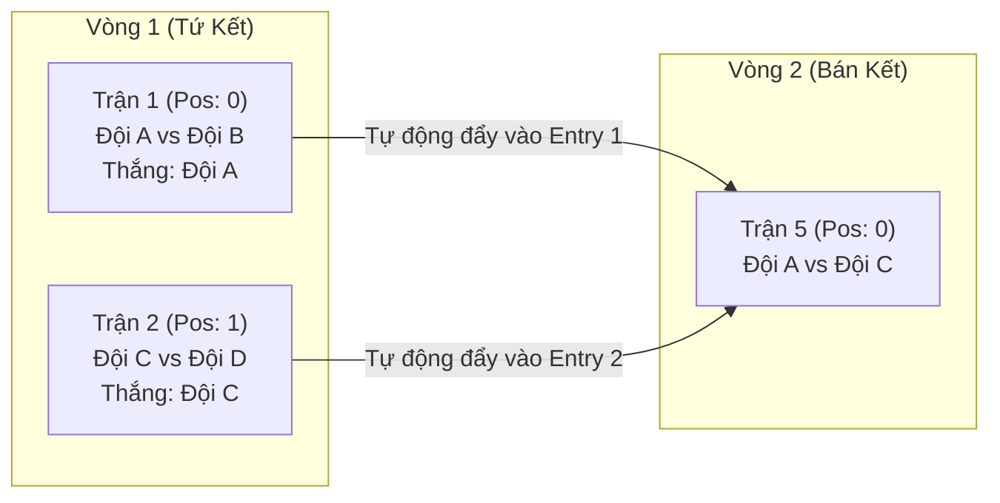

# Động Cơ Giải Đấu — Tournament Engine (TypeScript BWF)

Tài liệu này đặc tả toàn bộ thuật toán, công thức toán học và logic nghiệp vụ của **TournamentEngine** được port từ Dart sang **TypeScript thuần (Zero Dependencies)**, tuân thủ chặt chẽ quy chế thi đấu của Liên đoàn Cầu lông Thế giới (**Badminton World Federation - BWF**).

---

## 1. Luật Chấm Điểm & Xác Thực Trận Đấu (Scoring & Validation)

### 1.1. Quy Chuẩn Điểm Số BWF (BWF Scoring Rules)
- **Điểm đích cơ sở**: Mặc định là `21` điểm (hoặc cấu hình tùy chỉnh: `11`, `15`, `30`, `31` điểm).
- **Luật Cách Biệt 2 Điểm (Deuce)**:
  - Nếu hai bên hòa ở điểm `pointsPerGame - 1` (ví dụ: `20 - 20` trong set 21 điểm), ván đấu tiếp tục cho đến khi một bên tạo được khoảng cách **2 điểm** (ví dụ: `22 - 20`, `24 - 22`).
- **Luật Kịch Trần (Cap Point)**:
  - Để tránh trận đấu kéo dài vô tận, BWF quy định mức điểm tối đa:
    - Set 21 điểm: Kịch trần ở **30 điểm** (thắng `30 - 28` khi tạo cách biệt 2 điểm trước, hoặc `30 - 29` khi hòa 29-29 chạm 30 điểm trước theo luật BWF 7.4).
    - Set 15 điểm: Kịch trần ở **21 điểm** (thắng `21 - 19` hoặc `21 - 20`).
    - Set 11 điểm: Kịch trần ở **15 điểm** (thắng `15 - 13` hoặc `15 - 14`).
- **Chế Độ Chạm Điểm Thắng Ngay (Sudden Death)**:
  - Khi bật `isSuddenDeath = true`: Bên nào chạm mốc `pointsPerGame` trước sẽ giành chiến thắng ngay lập tức, không áp dụng deuce hay cách biệt 2 điểm (ví dụ: `31 - 30` thì đội 31 điểm thắng).

### 1.2. Thể Thức Trận Đấu (Match Formats)
- **Best of 3 (Đấu 3 ván thắng 2)**: Bên nào thắng trước 2 game sẽ thắng cả trận. Nếu tỷ số đang là 2-0 thì không được nhập điểm game thứ 3.
- **Best of 1 (Đấu 1 ván duy nhất)**: Thường dùng ở vòng bảng để tiết kiệm thời gian và thể lực (ví dụ: 1 ván 31 điểm Sudden Death).
- **Best of 5 (Đấu 5 ván thắng 3)**: Sử dụng cho các giải đỉnh cao hoặc trận chung kết đặc biệt.

```typescript
// Interface GameScore & StageConfig
export interface GameScore {
  scoreA: number;
  scoreB: number;
}

export interface StageConfig {
  gamesPerMatch: 1 | 3 | 5;
  pointsPerGame: number;
  isSuddenDeath: boolean;
}

// Logic Validate Game Score
export function validateGameScore(
  scoreA: number,
  scoreB: number,
  config: StageConfig
): { isValid: boolean; error?: string } {
  const { pointsPerGame, isSuddenDeath } = config;
  const target = pointsPerGame;

  if (scoreA < 0 || scoreB < 0) {
    return { isValid: false, error: "Điểm số không được âm." };
  }

  // Chế độ Sudden Death (Chạm điểm là thắng)
  if (isSuddenDeath) {
    if (scoreA !== target && scoreB !== target) {
      return { isValid: false, error: `Cần có một bên chạm mốc ${target} điểm.` };
    }
    if (scoreA > target || scoreB > target) {
      return { isValid: false, error: `Điểm số không được vượt quá mốc ${target}.` };
    }
    if (scoreA === target && scoreB === target) {
      return { isValid: false, error: "Không được phép hòa điểm ở chế độ Sudden Death." };
    }
    return { isValid: true };
  }

  // Chuẩn BWF
  const maxScore = Math.max(scoreA, scoreB);
  const minScore = Math.min(scoreA, scoreB);
  const cap = target === 21 ? 30 : target === 15 ? 21 : target === 11 ? 15 : target + 9;

  if (maxScore < target) {
    return { isValid: false, error: `Bên thắng phải đạt tối thiểu ${target} điểm.` };
  }

  if (maxScore === target) {
    if (maxScore - minScore < 2) {
      return { isValid: false, error: `Phải thắng cách biệt tối thiểu 2 điểm (hoặc chạm ${cap}).` };
    }
    return { isValid: true };
  }

  // Điểm vượt qua target (Vào tình huống deuce)
  if (maxScore > target) {
    if (maxScore === cap) {
      // Khi chạm cap: hợp lệ nếu cách biệt 2 điểm (30-28) hoặc 1 điểm khi hòa deuce cuối cùng (30-29).
      const diff = maxScore - minScore;
      if (diff !== 1 && diff !== 2) {
        return { isValid: false, error: `Ở mốc kịch trần ${cap}, tỷ số chỉ hợp lệ với cách biệt 1 điểm (chạm trần sau hòa ${cap - 1}) hoặc 2 điểm.` };
      }
      return { isValid: true };
    }
    if (maxScore > cap) {
      return { isValid: false, error: `Điểm số không được vượt quá kịch trần ${cap}.` };
    }
    if (maxScore - minScore !== 2) {
      return { isValid: false, error: `Khi vượt quá ${target}, bắt buộc phải cách biệt đúng 2 điểm.` };
    }
  }

  return { isValid: true };
}
```

---

## 2. Thuật Toán Phân Bổ Hạt Giống (Seeding Algorithms)

### 2.1. Phân Bổ Hạt Giống Nhánh Đấu Chuẩn BWF (Knockout Seed Placement)
Theo điều lệ BWF Section 5.1.2:
- **Seed 1**: Đặt tại dòng đầu tiên của nhánh trên (vị trí `0`).
- **Seed 2**: Đặt tại dòng cuối cùng của nhánh dưới (vị trí `bracketSize - 1`).
- **Seed 3 & 4**: Bốc thăm vào 2 góc phần tư còn lại:
  - Một hạt giống vào đỉnh nhánh dưới (vị trí `bracketSize / 2`).
  - Một hạt giống vào đáy nhánh trên (vị trí `bracketSize / 2 - 1`).
- **Seed 5 đến 8**: Bốc thăm ngẫu nhiên vào các góc 1/8 tương ứng.

```typescript
export function generateSeedPositions(bracketSize: number): number[] {
  if (bracketSize < 2) return [0];
  const positions: number[] = new Array(bracketSize).fill(0);
  
  // Seed 1 & 2
  positions[0] = 1;
  positions[bracketSize - 1] = 2;

  if (bracketSize >= 4) {
    positions[Math.floor(bracketSize / 2) - 1] = 4;
    positions[Math.floor(bracketSize / 2)] = 3;
  }

  if (bracketSize >= 8) {
    positions[Math.floor(bracketSize / 4) - 1] = 6;
    positions[Math.floor(bracketSize / 4)] = 5;
    positions[Math.floor((3 * bracketSize) / 4) - 1] = 8;
    positions[Math.floor((3 * bracketSize) / 4)] = 7;
  }

  return positions;
}
```

### 2.2. Thuật Toán Chia Bảng Rắn Lượn (Snake Seeding for Groups)
Khi giải đấu có nhiều bảng đấu vòng tròn, các đội hạt giống được chia theo mô hình **Snake (rắn uốn khúc)** để đảm bảo thực lực phân bổ đồng đều:
- Vòng 1: Hạt giống 1 $\rightarrow$ Bảng A, Hạt giống 2 $\rightarrow$ Bảng B, Hạt giống 3 $\rightarrow$ Bảng C...
- Vòng 2 (Đảo chiều): Hạt giống 4 $\rightarrow$ Bảng C, Hạt giống 5 $\rightarrow$ Bảng B, Hạt giống 6 $\rightarrow$ Bảng A...
- Các đội còn lại (không hạt giống) được bốc thăm ngẫu nhiên rải đều vào các bảng có số đội ít nhất.

---

## 3. Thuật Toán Sinh Nhánh Loại Trực Tiếp (Knockout Bracket Generation)

### 3.1. Tính Kích Thước Nhánh (Bracket Size & Suất Miễn Đấu - Bye)
Kích thước nhánh đấu phải luôn là lũy thừa bậc 2 gần nhất $\ge N$ (số đội tham gia):
$$\text{BracketSize} = 2^{\lceil \log_2(N) \rceil}$$
- Số suất miễn đấu:
$$\text{TotalByes} = \text{BracketSize} - N$$

### 3.2. Bảo Vệ Hạt Giống Hàng Đầu (BWF Bye Protection)
Theo quy định BWF, suất miễn đấu **không được bốc ngẫu nhiên** mà phải ưu tiên tuyệt đối ghép cho các hạt giống cao nhất theo thứ tự:
1. Đối thủ vòng 1 của **Hạt giống 1** sẽ nhận suất Bye đầu tiên (Seed 1 được vào thẳng vòng 2).
2. Đối thủ vòng 1 của **Hạt giống 2** nhận suất Bye thứ hai.
3. Lần lượt tiếp tục cho Seed 3, Seed 4...

### 3.3. Thuật Toán Tránh Chạm Trán Cùng Câu Lạc Bộ (Club Separation)
Khi bốc thăm các đội không hạt giống vào vòng 1:
- Nếu hai đội cùng một câu lạc bộ (`club`), hệ thống sẽ hoán vị (swap) vị trí đối thủ để tránh họ loại nhau ngay trận mở màn.

---

## 4. Cơ Chế Thăng Hạng & Thu Hồi Tự Động (Advancement & Recursive Revert)

Đây là thành phần cốt lõi đảm bảo tính toàn vẹn của nhánh Knockout khi có biến động kết quả trận đấu:



### 4.1. Công Thức Thăng Hạng Đội Thắng (Winner Advancement Formula)
Với một trận đấu ở vòng thứ $\text{Round}$ (1-indexed, ví dụ Vòng 1 $\rightarrow$ Vòng 2...) có chỉ số vị trí `bracketPosition = P` (0-indexed):
- **Trận đấu kế tiếp ở vòng sau**:
  $$\text{NextRound} = \text{Round} + 1$$
  $$\text{NextPosition} = \lfloor \frac{P}{2} \rfloor$$
  *(Lưu ý: Nếu quy ước theo quy mô số đội của vòng đấu là $K$, thì vòng kế tiếp có số đội giảm một nửa: $K_{\text{next}} = \frac{K}{2}$)*
- **Cổng điền vào trận tiếp theo**:
  - Nếu $P \pmod 2 == 0$ (vị trí chẵn): Điền đội thắng vào `entry1_id` của trận kế tiếp.
  - Nếu $P \pmod 2 == 1$ (vị trí lẻ): Điền đội thắng vào `entry2_id` của trận kế tiếp.

### 4.2. Cơ Chế Thu Hồi Đệ Quy (Cascade Revert Mechanism)
Khi Ban tổ chức phát hiện nhập nhầm điểm hoặc trận đấu bị hủy:
1. Trận đấu hiện tại được reset về `status = 'pending'`, xóa `winner_id` và xóa `score`.
2. Kiểm tra trận đấu ở vòng kế tiếp:
   - Xóa `entry_id` tương ứng đã thăng hạng lên trước đó.
   - Nếu trận đấu ở vòng kế tiếp **đã diễn ra hoặc cũng đã có kết quả**, hàm sẽ **đệ quy hủy tiếp trận đấu đó** và dọn sạch các vòng xa hơn nữa (Bán kết $\rightarrow$ Chung kết).
3. Đảm bảo dữ liệu nhánh đấu không bao giờ bị tình trạng "vết ma" (dangling winner).

> **Ràng buộc triển khai:** Client chỉ dùng engine để xem trước và validate UX. Việc ghi kết quả, đẩy người thắng và cascade rollback phải chạy trong **một PostgreSQL RPC transaction**. RPC nhận `expectedVersion` và `requestId`; từ chối dữ liệu cũ, dùng `requestId` để idempotent, ghi before/after vào `activity_logs`, rồi mới phát Realtime event.

---

## 5. Xếp Lịch Thi Đấu Vòng Tròn (Round Robin — Berger Method)

Áp dụng phương pháp vòng tròn xoay trục (Circle Method):
- Nếu số đội lẻ ($N$ lẻ): Bổ sung 1 đội ảo `BYE` để số đội chẵn ($N+1$).
- Cố định đội số 1, xoay tròn $N-1$ đội còn lại theo chiều kim đồng hồ qua từng vòng đấu ($N-1$ lượt đấu).
- Tự động lọc bỏ các trận đấu gặp đội `BYE`.

---

## 6. Xếp Hạng Vòng Bảng & Tiêu Chí Hòa Điểm (BWF Tie-Breaking)

Khi tính bảng xếp hạng vòng tròn, thứ tự ưu tiên tuyệt đối theo tiêu chuẩn BWF:

1. **Tổng số trận thắng (`matchesWon`)**: Đội nào thắng nhiều trận hơn đứng trên.
2. **Hiệu số game (`gameDifference`)**: $\text{Games Won} - \text{Games Lost}$.
3. **Hiệu số điểm (`pointDifference`)**: $\text{Points Won} - \text{Points Lost}$.
4. **Đối đầu trực tiếp (Head-to-Head)**: Nếu 2 đội bằng nhau cả 3 chỉ số trên, kết quả trận đấu giữa 2 đội đó sẽ quyết định thứ hạng.
5. **Giải quyết hòa $\ge 3$ đội (Subgroup Tie-Break)**: Hệ thống tự động tạo một "Bảng xếp hạng thu nhỏ" chỉ tính riêng các trận đối đầu giữa các đội bị hòa điểm với nhau.

---

## 7. Cấu Trúc Mã Nguồn & Bộ Kiểm Thử (Engine Modules & Tests)

Hiện tại toàn bộ Engine được tổ chức trong thư mục `src/engine/` với **83 unit tests (100% pass)**:

| Module | File | Chức năng chính | Trạng thái |
|---|---|---|:---:|
| **Scoring** | [`scoring.ts`](file:///g:/AppHavuco/tournament-web/src/engine/scoring.ts) | Validate điểm BWF, Deuce, Cap 30, Sudden Death, kiểm tra kết thúc trận | ✅ 13 tests |
| **Seeding** | [`seeding.ts`](file:///g:/AppHavuco/tournament-web/src/engine/seeding.ts) | Phân bổ hạt giống, thuật toán Snake Seeding cho 2-7 bảng | ✅ Tested |
| **Round Robin** | [`round-robin.ts`](file:///g:/AppHavuco/tournament-web/src/engine/round-robin.ts) | Sinh lịch thi đấu vòng tròn theo thuật toán xoay trục Berger | ✅ Tested |
| **Bracket** | [`bracket.ts`](file:///g:/AppHavuco/tournament-web/src/engine/bracket.ts) | Sinh cây Knockout, Bye placement, Club separation tránh gặp cùng CLB | ✅ 4 tests |
| **Standings** | [`standings.ts`](file:///g:/AppHavuco/tournament-web/src/engine/standings.ts) | Bảng xếp hạng BWF, xử lý Walkover đầy đủ, tuyển chọn Đội Nhì tốt nhất | ✅ 7 tests |
| **Advancement** | [`advancement.ts`](file:///g:/AppHavuco/tournament-web/src/engine/advancement.ts) | Ghép cặp vòng bảng sang Knockout, Rollback Cascade, hỗ trợ 2-16 bảng | ✅ 7 tests |
| **Flexible Engine** | [`flexible-tournament.ts`](file:///g:/AppHavuco/tournament-web/src/engine/flexible-tournament.ts) | Trình điều phối giải đấu đa giai đoạn (Group + Knockout) linh hoạt | ✅ 14 tests |
| **Kiểu dữ liệu** | [`types.ts`](file:///g:/AppHavuco/tournament-web/src/engine/types.ts) | Định nghĩa toàn bộ interfaces, types thuần TypeScript (0 dependency) | ✅ Strictly Typed |
| **Tổng kiểm thử** | `src/engine/__tests__/` | Chạy qua Vitest: `npm test` | **83/83 passed** |
