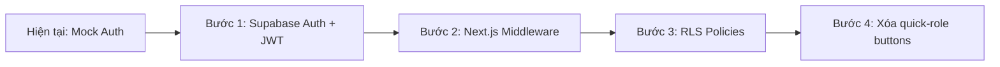
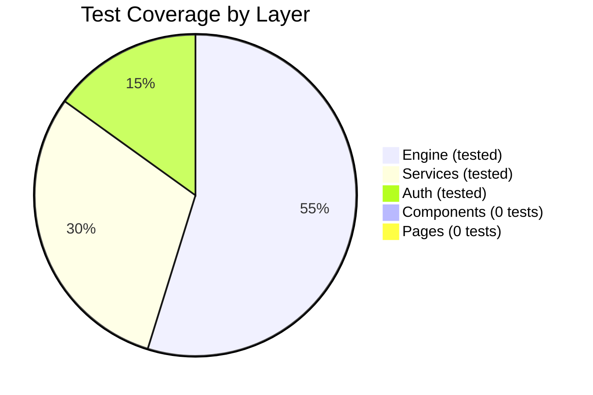

# 🏸 Báo Cáo Audit Toàn Diện — Badminton Tournament Platform

**Dự án:** `g:\AppHavuco\tournament-web`
**Ngày audit:** 2026-09-17
**Phiên bản:** `1.0.0`
**Stack:** Next.js 15 · React 19 · TypeScript · Tailwind CSS 3 · Supabase · Vitest

---

## Tổng Quan Nhanh

| Metric | Value |
|---|---|
| Tổng số file TypeScript/TSX | **68 files** |
| Tổng dòng code (src/) | **21,799 lines** |
| Số trang (routes) | **18 pages** |
| Số component dùng chung | **5 components** |
| Số service | **7 services** |
| Số engine module | **9 modules** |
| Số test file | **9 files (1,313 lines)** |
| Dependencies | **28 prod + 9 dev** |
| i18n languages | **2 (vi, en)** |

---

## Điểm Đánh Giá Tổng Thể

````carousel
### ✅ Điểm Mạnh

- **Engine thuật toán chất lượng cao** — 0 `any`, 0 `eslint-disable`, 100% strictly typed. Implement đúng BWF rules (deuce, cap, Berger rotation, snake seeding)
- **Kiến trúc rõ ràng** — Tách biệt engine / services / types / i18n / pages
- **Clean codebase** — 0 `console.log`, 0 `TODO/FIXME/HACK`, 0 `@ts-ignore`
- **i18n foundation tốt** — 100% key symmetry giữa vi/en, typed dictionary, generator functions
- **Documentation đầy đủ** — 7 docs files (Architecture, Database, Engine, UI/UX, Roadmap, API, Registration)
- **Test engine nghiêm túc** — 73 tests covering scoring, seeding, bracket, advancement, standings
- **TypeScript strict mode** — `"strict": true` trong tsconfig.json
<!-- slide -->
### ❌ Vấn Đề Nghiêm Trọng (Trạng thái sau Phase 1)

| # | Severity | Issue | Trạng thái |
|:---:|:---:|---|:---:|
| 1 | 🔴 CRITICAL | Auth hoàn toàn giả — bỏ qua password, PIN chấp nhận mọi giá trị | ⏳ Chờ Phase 2 |
| 2 | 🔴 CRITICAL | Role escalation buttons trong production UI | ⏳ Chờ Phase 2 |
| 3 | 🔴 CRITICAL | Engine crash khi 5+ groups dùng `all_top_two` | ✅ **ĐÃ FIX (Phase 1)** |
| 4 | 🔴 HIGH | Supabase query result bị discard, luôn return mock data | ✅ **ĐÃ FIX (Phase 1)** |
| 5 | 🔴 HIGH | Update tournament xóa toàn bộ events rồi tạo lại | ✅ **ĐÃ FIX (Phase 1)** |
| 6 | 🟠 HIGH | 3 God Components tổng ~4.350 lines | ⏳ Chờ Phase 3 |
| 7 | 🟠 HIGH | Walkover stats không tính đủ cho bên thua | ✅ **ĐÃ FIX (Phase 1)** |
| 8 | 🟡 MEDIUM | 200+ hardcoded strings ngoài i18n | ⏳ Chờ Phase 4 |
| 9 | 🟡 MEDIUM | 53 instances of `as any` casting | ⏳ Chờ Phase 3-4 |
| 10 | 🟡 MEDIUM | 0 test cho React components/pages | ⏳ Chờ Phase 4 |
````

---

## 1. 🔴 Bảo Mật & Xác Thực (CRITICAL)

> [!CAUTION]
> Hệ thống auth hiện tại **KHÔNG CÓ BẤT KỲ BẢO MẬT THỰC SỰ NÀO**. Đây là rào cản lớn nhất trước khi đưa lên production.

### 1.1 Password bị bỏ qua hoàn toàn

[authService.ts](file:///g:/AppHavuco/tournament-web/src/lib/services/authService.ts) — `signInWithEmail(email, _password)`:
- Tham số `_password` bị **ignore** hoàn toàn
- Nhập `admin@badminton.vn` → đăng nhập Super Admin **không cần mật khẩu**
- Bất kỳ email nào chứa `@` → tự động cấp quyền `organizer`

### 1.2 Court PIN chấp nhận mọi giá trị

```typescript
// signInWithCourtPin — accepts ANY 4+ char string
if (pin === '1234' || pin === '8888' || pin.length >= 4)
```

### 1.3 Role Escalation trong UI

| File | Vấn đề |
|---|---|
| [ProtectedRoute.tsx](file:///g:/AppHavuco/tournament-web/src/components/auth/ProtectedRoute.tsx) | Nút "1-Click Test: Vào Nhanh Với Tư Cách BTC" — bypass toàn bộ auth |
| [UserMenu.tsx](file:///g:/AppHavuco/tournament-web/src/components/auth/UserMenu.tsx) | Quick Switch Role buttons cho phép chuyển sang `admin` tức thì |

### 1.4 Session & Cookie không an toàn

- Token dạng plaintext: `'token_' + user.id + '_' + Date.now()`
- Session lưu `localStorage` — vulnerable to XSS
- Cookie `auth_role=admin` — user có thể sửa trực tiếp trong DevTools
- Supabase Auth SDK (`@supabase/ssr`) **hoàn toàn không được sử dụng**
- Không có server-side middleware protection

### 1.5 Không có authorization trong service layer

[tournamentService.ts](file:///g:/AppHavuco/tournament-web/src/lib/services/tournamentService.ts):
- `createTournamentWithEvents` và `updateTournamentWithEvents` — **0 kiểm tra quyền**
- Ai cũng có thể ghi đè bất kỳ tournament nào nếu biết slug

### Khuyến nghị



---

## 2. 🔴 Engine Bugs (CRITICAL + HIGH)

### 2.1 🔴 CRASH: 5+ groups với `all_top_two` (CRITICAL)

**File:** [advancement.ts](file:///g:/AppHavuco/tournament-web/src/engine/advancement.ts)

Khi `numGroups = 5` và rule `all_top_two`:
- Total teams = 10, bracket size = 16, byes = 6
- `firsts` array chỉ có 5 phần tử
- `firsts[5]` → `undefined` → **`TypeError: Cannot read properties of undefined`**

```
for (let i = 0; i < byesCount; i++) {
    resultSlots.push(firsts[i]); // 💥 firsts[5] = undefined khi numGroups=5
}
```

> [!IMPORTANT]
> **Tác động:** Mọi giải đấu 5-7 bảng dùng `all_top_two` sẽ **crash ngay lập tức** khi tạo nhánh đấu.

### 2.2 🔴 Walkover Stats sai (HIGH)

**File:** [standings.ts](file:///g:/AppHavuco/tournament-web/src/engine/standings.ts)

Khi xử lý walkover:
- Bên **thắng**: `gamesWon += 2`, `pointsWon += 42` ✅
- Bên **thua**: `gamesLost` **KHÔNG tăng**, `pointsLost` **KHÔNG tăng** ❌
- Hardcode 2 games + 42 points — sai cho format 1x31 hoặc 3x15

### 2.3 🟡 BWF 3-Way Tie tính sai (MEDIUM)

BWF Clause 16.1.3 yêu cầu khi 3+ đội hòa điểm, tie-break phải tính **chỉ từ các trận giữa các đội hòa**. Code hiện tại dùng **tất cả trận trong bảng**, dẫn đến xếp hạng sai.

### 2.4 🟡 Club Separation swap logic thiếu (MEDIUM)

[bracket.ts](file:///g:/AppHavuco/tournament-web/src/engine/bracket.ts) — `applyClubSeparation`:
- Chỉ scan forward, không scan backward
- Không verify swap mới có tạo conflict khác không

---

## 3. 🟠 Kiến Trúc & Code Quality

### 3.1 God Components — 4,657 lines trong 3 files

| File | Lines | Vấn đề chính |
|---|:---:|---|
| [organizer-draw/page.tsx](file:///g:/AppHavuco/tournament-web/src/app/prototypes/organizer-draw/page.tsx) | **2,204** | Draw engine + group standings + scoring modal + bracket view + court dispatch — tất cả trong 1 component |
| [create/page.tsx](file:///g:/AppHavuco/tournament-web/src/app/admin/tournaments/create/page.tsx) | **1,439** | 22 useState hooks, 4-step wizard, VietQR preview, scoring rules — 1 component |
| [court-dispatcher/page.tsx](file:///g:/AppHavuco/tournament-web/src/app/prototypes/court-dispatcher/page.tsx) | **1,014** | Stadium control + live clock + warmup timer + 2 modals — 1 component |

**Hậu quả:**
- `court-dispatcher` re-render **toàn bộ 1,014 lines mỗi giây** do `setInterval` cập nhật `currentTime`
- `create/page` re-render toàn bộ khi gõ 1 ký tự vào bất kỳ input nào
- Không thể test riêng từng phần

### Khuyến nghị tách component

```mermaid
graph TD
    A[organizer-draw 2,204 lines] --> A1[useOrganizerDraw hook]
    A --> A2[GroupStageView]
    A --> A3[KnockoutBracketView]
    A --> A4[ManualPlacementGrid]
    A --> A5[MatchScoreModal]

    B[create 1,439 lines] --> B1[useCreateTournament hook]
    B --> B2[StepGeneralInfo]
    B --> B3[StepEvents]
    B --> B4[StepScoring]
    B --> B5[StepDrawRules]
    B --> B6[VietQrPreview]

    C[court-dispatcher 1,014 lines] --> C1[LiveClock ⏰]
    C --> C2[CourtCard]
    C --> C3[MatchQueue]
    C --> C4[DispatchModal]
    C --> C5[FinalizeModal]
```



### 3.2 Service Layer — Data Integrity Issues

**File:** [tournamentService.ts](file:///g:/AppHavuco/tournament-web/src/lib/services/tournamentService.ts)

| Issue | Severity | Detail |
|---|:---:|---|
| Supabase data bị discard | 🔴 | `getTournaments()` fetch từ DB nhưng **luôn return mock data** — biến `data` không bao giờ được dùng |
| Destructive update | 🔴 | `updateTournamentWithEvents()` **xóa toàn bộ** `tournament_events` rồi insert lại — phá vỡ FK references (registrations, matches) |
| Silent error swallowing | 🟠 | Catch blocks return `success: true` + "Offline Mode" — che giấu lỗi DB thực sự |

### 3.3 `as any` Casting — 53 instances

| Location | Count |
|---|:---:|
| `src/lib/services/` (Supabase queries) | 25 |
| `src/app/admin/tournaments/create/` | 11 |
| `src/app/prototypes/` | 4 |
| Others | 13 |

---

## 4. 📊 Test Coverage Analysis

### Hiện trạng: 9 test files, 73 tests, 1,313 lines



### Coverage Gaps chi tiết

| Module | ✅ Tested | ❌ NOT Tested |
|---|---|---|
| **Scoring** | BWF 3x21, 1x31, 3x15, deuce, cap | 21-21 sudden death tie, NaN scores |
| **Seeding** | 8-draw positions, snake 2-7 groups | 16/32/64-draw, non-power-of-2 |
| **Standings** | 3-team ranking, best runner-ups | **Walkover (Bug 2 ẩn!)**, 3-way tie, true H2H |
| **Advancement** | 2-4 groups, basic rollback | **5+ groups `all_top_two` (Bug 1 ẩn!)**, `winners_only`, `cross_p3` |
| **Services** | CRUD, slug search, status filter, dispatcher FSM | Real Supabase, concurrency, expired quota |
| **Components** | — | **0/5 components tested** |
| **Pages** | — | **0/18 pages tested** |
| **i18n** | Key parity vi/en | Runtime rendering, fallback handling |

> [!WARNING]
> **Bug 1 (crash 5-group) và Bug 2 (walkover stats sai) đều ẩn vì KHÔNG CÓ TEST cho các case đó.**

---

## 5. 🌐 i18n & Localization

### Hiện trạng

| Aspect | Status |
|---|---|
| Dictionary keys vi/en match | ✅ 100% parity (364 keys) |
| Generator functions | ✅ Hoạt động tốt |
| Context + cookie persistence | ✅ Clean implementation |

### Vấn đề

| # | Issue | Impact |
|:---:|---|---|
| 1 | **200+ inline ternaries** `{isEn ? '...' : '...'}` trong 13 files | Không maintainable, dễ miss khi thêm ngôn ngữ |
| 2 | **3 components hardcode Vietnamese** — `GroupStandingsTable`, `BestRunnerUpsTable`, `ProtectedRoute` | Không đổi ngôn ngữ được |
| 3 | **Missing dictionary scopes** — `auth`, `login`, `registerOrganizer`, `tables`, `errors` | Buộc dev dùng ternary thay vì `t()` |

---

## 6. 🔧 Type System

### Duplications & Inconsistencies

| Issue | Files | Impact |
|---|---|---|
| `GameScore` duplicate | `engine/types.ts` vs `types/database.ts` | Confusion khi import |
| `StageConfig` divergent | `engine/types.ts` (có `maxCapPoints`) vs `types/tournament.ts` (thiếu) | Mất autocomplete |
| `EventFormat` mismatch | engine: `'round_robin'` vs database: `'group'` | Mapping friction |
| `CreateTournamentInput` dual | `types/tournament.ts` (snake_case) vs `services/tournamentService.ts` (camelCase) | Dễ dùng sai field |

---

## 7. ⚡ Performance

| Issue | File | Impact |
|---|---|---|
| 1s interval re-render toàn page | `court-dispatcher/page.tsx` | CPU waste, frame drops |
| AuthContext value không memo | `AuthContext.tsx` | Mọi consumer re-render khi parent render |
| QR Code không memo | `create/page.tsx` | Re-generate SVG mỗi keystroke |
| WebSocket update re-render all cards | `page.tsx` (home) | 1 điểm scored → render lại tất cả tournament cards |
| Deep clone on score edit | `organizer-draw/page.tsx` | Spread toàn bộ schedule array mỗi lần nhập điểm |

---

## 8. 📦 Dependencies

### Installed nhưng chưa rõ mức sử dụng

| Package | Status |
|---|---|
| `zustand` | Declared nhưng **không thấy store nào** — toàn bộ state dùng useState/useContext |
| `@supabase/ssr` | Installed nhưng auth **dùng localStorage** thay vì Supabase Auth |
| `react-hook-form` + `@hookform/resolvers` + `zod` | Installed nhưng `create/page.tsx` dùng **22 raw useState** |
| `@playwright/test` | Declared nhưng **0 e2e test files** |
| 12 Radix UI packages | Installed nhưng `UserMenu` **tự code dropdown** thay vì dùng `@radix-ui/react-dropdown-menu` |

---

## 9. 📁 Cấu Hình & DevOps

| Item | Status | Note |
|---|:---:|---|
| Database Schema (`sql/`) | ✅ | Sẵn sàng: `schema.sql` (16 bảng, RLS) và `rpcs.sql` (553 dòng PL/pgSQL) |
| ESLint config | ⚠️ | Không có file config riêng, chỉ dùng Next.js default |
| `.env.local` | ⚠️ | Chứa **Supabase credentials thật** — cần check `.gitignore` |
| `graphify-out/` | ❌ | Chưa generate knowledge graph |
| `update-graphify.bat` | ❌ | Chưa tạo script |
| CI/CD pipeline | ❌ | Không có GitHub Actions / workflow |
| Prettier | ❌ | Không có code formatter config |
| Husky / lint-staged | ❌ | Không có pre-commit hooks |

---

## 10. 🎯 Roadmap Khuyến Nghị Theo Ưu Tiên

### Phase 1: 🔴 Critical Fixes — ✅ ĐÃ HOÀN THÀNH
*Đã triển khai & pass 83/83 unit tests + build thành công 18 routes:*

- [x] **Fix Engine Bug 1** — Crash 5+ groups `all_top_two` trong `advancement.ts`
- [x] **Fix Engine Bug 2** — Walkover stats corruption trong `standings.ts`
- [x] **Fix Engine Bug 3** — Sudden death 21-21 trả winner sai trong `scoring.ts`
- [x] **Fix Engine Bug 4** — Club separation swap conflict trong `bracket.ts`
- [x] **Viết tests cho Bug 1, 2, 3** — 10 test cases mới, tổng test tăng từ 73 lên 83
- [x] **Fix `getTournaments()`** — Map dữ liệu Supabase vào `MockTournament` thay vì discard
- [x] **Fix `updateTournamentWithEvents()`** — Dùng `upsert` thay vì delete-all + re-insert
- [x] **Xóa silent `success: true`** trong catch blocks
- [x] **Memoize AuthContext provider value** — Tránh re-render không cần thiết toàn bộ consumers

### Phase 2: 🟠 Auth & Security (2-3 tuần)

- [ ] Integrate **Supabase Auth** (`@supabase/ssr`) với real password hashing
- [ ] Tạo **Next.js middleware.ts** cho server-side route protection
- [ ] Setup **Supabase RLS policies** cho tournaments, events, matches
- [ ] **Xóa** tất cả 1-Click Test / Quick Switch Role buttons
- [ ] Chuyển session sang **HTTP-only cookies** (signed JWT)

### Phase 3: 🟡 Architecture Refactor (3-4 tuần)

- [ ] Tách **organizer-draw** (2,204 lines) → 5+ components + custom hook
- [ ] Tách **create page** (1,439 lines) → react-hook-form + zod + step components
- [ ] Tách **court-dispatcher** (1,014 lines) → `<LiveClock />` + sub-components
- [ ] Memo **AuthContext** provider value
- [ ] Consolidate types (`GameScore`, `StageConfig`, `EventFormat`)
- [ ] Dùng **Radix UI** dropdown cho UserMenu thay vì tự code
- [ ] Dùng **Zustand** stores hoặc remove dependency

### Phase 4: 🟢 Quality & i18n (2-3 tuần)

- [ ] Thêm **dictionary scopes** cho auth, login, tables, errors
- [ ] Refactor 200+ inline ternaries → `t()` calls
- [ ] i18n hóa `GroupStandingsTable`, `BestRunnerUpsTable`, `ProtectedRoute`
- [ ] Thêm **React Testing Library** tests cho components
- [ ] Thêm **Playwright e2e** tests (đã install, chưa dùng)
- [ ] Setup **ESLint config** + **Prettier** + **Husky pre-commit**
- [ ] Setup **GitHub Actions** CI pipeline

---

> [!NOTE]
> Tổng thể, dự án có **nền tảng kỹ thuật tốt** (engine chất lượng, TypeScript strict, clean code). Các vấn đề chính tập trung ở **auth giả lập chưa chuyển sang production**, **3 god components cần tách**, và **2 engine bugs cần fix ngay**. Với 21,800 dòng code cho một nền tảng tournament management, đây là mức complexity hợp lý nhưng cần refactor sớm trước khi scale thêm features.
